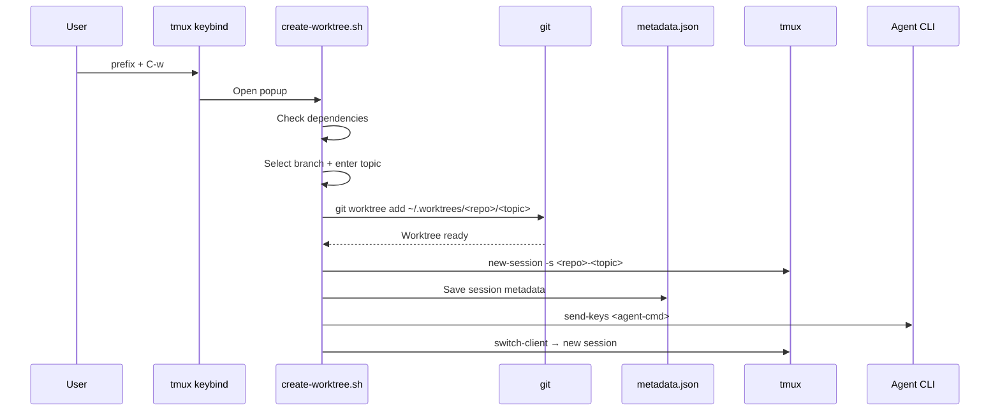
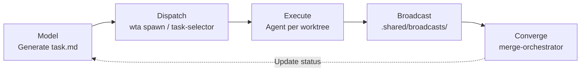

<p align="center">
  <h1 align="center">tmux-worktree-agent</h1>
  <p align="center">
    <strong>Human multithreading for AI-assisted development</strong>
  </p>
  <p align="center">
    Run multiple AI coding agents in parallel — each in its own branch, its own directory, its own tmux session. One keystroke to create, browse, or jump to any agent.
  </p>
  <p align="center">
    <a href="#-quick-start"></a>
    <a href="#-features"></a>
    <a href="#-architecture"></a>
    <a href="LICENSE"></a>
  </p>
</p>

<br/>

<!-- <p align="center">
  
</p> -->

<p align="center"><em>Session browser with live agent preview &middot; aggregated status bar &middot; one-key jump to agents needing attention</em></p>

---

## Why?

You're using Claude Code / Gemini CLI / Codex to write features. You want to work on OAuth **and** refactor the DB layer **and** write tests — all at the same time.

But one terminal, one branch, one agent session can only do one thing.

**tmux-worktree-agent** removes the bottleneck: press one key, get a fully isolated development context — its own branch, its own directory, its own agent. A session browser lets you monitor everything at a glance.

---

## Quick Start

### Requirements

| Dependency | Version | Purpose |
|:-----------|:--------|:--------|
| **tmux** | 3.0+ (3.2+ for popups) | Core runtime |
| **git** | 2.5+ | Worktree support |
| **fzf** | 0.20+ | Interactive selection |
| **jq** | any | Metadata handling |

Optional: `bat` (syntax-highlighted previews), `gum` (prettier prompts), any AI agent CLI.

### Install with TPM

Add to your `~/.tmux.conf`:

```tmux
set -g @plugin 'KMerdan/tmux-worktree-agent'
```

Reload and install:

```bash
# Inside tmux
prefix + I
```

### Manual Install

```bash
git clone https://github.com/KMerdan/tmux-worktree-agent \
    ~/.tmux/plugins/tmux-worktree-agent
```

Add to `~/.tmux.conf`:

```tmux
run-shell ~/.tmux/plugins/tmux-worktree-agent/worktree-agent.tmux
```

### Shell Integration (recommended)

Add to your `~/.bashrc` or `~/.zshrc`:

```bash
source ~/.tmux/plugins/tmux-worktree-agent/scripts/shell-init.sh
```

This gives you session banners when entering plugin-managed sessions.

### The 3-Key Workflow

| Keybind | What it does |
|:--------|:-------------|
| `prefix + w` | **Browse** — tree view of all projects and sessions, with live preview |
| `prefix + a` | **Jump** — instantly switch to the next agent waiting for your input |
| `prefix + ?` | **Help** — searchable keybinding reference with git quick-actions |

That's it. You're running.

---

## Features

### Session Browser

The browser (`prefix + w`) is your central navigation — a tree view of all projects and sessions with live preview:

```
  my-app  ⏎2 ●3                         │  my-app-auth  ⏎ needs input
   ⏎ auth  Fix OAuth flow                │  wt/auth-fix · claude · 2h ago
   ● tests  Write e2e tests              │  ─────────────────────────────
   ● ui  Refactor components             │  TASK-auth
     ⏎ ui-mobile  Mobile responsive      │  Fix OAuth flow
  ───��────────────────────────────        │  ─────────────────────────────
  other-repo                              │  I need permission to modify
                                          │  src/auth.ts.
  Enter:jump ^N:create ^T:tasks           │  (Esc to cancel)
  ^D:kill ^R:refresh                      │
```

- **Left** — tree of projects grouped by repo, sessions with status icons and descriptions
- **Right** — live preview: agent status, task context, terminal output, git status
- **Actions** — Enter (switch), Ctrl-N (create), Ctrl-T (tasks), Ctrl-D (kill), Ctrl-R (refresh)
- **Ghost recovery** — selecting a dead session offers to recreate or delete it

### Status Bar

Aggregated counts — constant-width regardless of how many agents you run:

```
▏⏎2 ●3 ◌1▕
```

| Icon | Color | Meaning |
|:-----|:------|:--------|
| `⏎` | Orange | Agents waiting for your input |
| `✗` | Red | Dead sessions |
| `●` | Green | Agents actively working |
| `◌` | Grey | Agents idle / no agent |

Attention-first: categories that need you appear first. Zero-count categories are hidden.

### Core Workflow

| Feature | Description |
|:--------|:------------|
| **One-keybind create** | `prefix + C-w` creates a git worktree, tmux session, and launches an agent — one step |
| **Quick create** | `prefix + W` — auto-detect branch, just type a topic name |
| **Quick-jump** | `prefix + a` — instantly switch to the next agent waiting for input |
| **Agent-agnostic** | Works with `claude`, `gemini`, `opencode`, `codex`, `aider`, or any CLI tool |

### Task System

| Feature | Description |
|:--------|:------------|
| **Markdown task DSL** | Define tasks in structured Markdown with IDs, priorities, and dependency graphs |
| **Batch dispatch** | Multi-select tasks from `task.md` and spawn all sessions at once (`prefix + T`) |
| **Task prompt menu** | Unified entry for generating, starting, updating, and merging tasks (`prefix + G`) |
| **Orchestrator awareness** | When generating task.md, the plugin injects `wta` CLI docs into your CLAUDE.md so the agent can drive the workflow |

### Orchestrator Mode (wta CLI)

When you use `prefix + G` > "Generate task.md", the plugin injects orchestrator awareness into your project's CLAUDE.md. The main agent (the one holding task.md) can then use the `wta` CLI to drive the entire workflow:

```bash
# Read-only — agent uses freely
wta status [repo]              # Session topology + agent state
wta broadcasts <repo>          # Read completion broadcasts
wta capture <session>          # Terminal output of a session
wta topology <task.md>         # Task dependency graph with live state
wta diff <session>             # Git diff vs base branch

# Mutating — agent confirms with you first
wta spawn <task.md> <task-id>  # Create worktree + session + start agent
wta send <session> <text>      # Send instruction to an agent
wta kill <session>             # Full cleanup
```

The orchestrator agent can spawn sub-tasks, monitor their progress, read broadcasts, guide stuck agents, and help merge completed work — all while you supervise.

**Important**: Only the orchestrator agent gets `wta` awareness. Sub-task agents remain focused on their individual task with no knowledge of the plugin.

### Context & Collaboration

| Feature | Description |
|:--------|:------------|
| **Shared context** | `.shared/context.md` — project-level knowledge shared across all agents (read-only) |
| **Private task context** | Each agent gets `preamble + task block` — global constraints plus local objective |
| **Broadcast protocol** | Agents write change notifications to `.shared/broadcasts/TASK-<id>.md` — async, zero-conflict |
| **Merge orchestrator** | Sends structured merge prompts to agents: dependency-ordered, diff-verified, conflict-safe |

### Resilience

| Feature | Description |
|:--------|:------------|
| **Orphan detection** | Detect and repair session/worktree/metadata/branch mismatches |
| **Auto-cleanup** | Stale metadata, orphaned `.shared/` and `.prompts/` directories are purged |
| **Ghost session recovery** | Browser detects sessions that died but still have worktrees — offers recreate or delete |
| **Session registration** | Adopt existing tmux sessions into the plugin's management |
| **Graceful destroy** | `prefix + K` cleans up session + worktree + branch + metadata in correct order |

---

## Keybinding Reference

### Primary

| Keybind | Description |
|:--------|:------------|
| `prefix + w` | Session browser — tree view of all projects and sessions |
| `prefix + a` | Jump to next agent waiting for input |
| `prefix + ?` | Help — searchable keybinding reference + git quick-actions |

### Agent Management

| Keybind | Description |
|:--------|:------------|
| `prefix + C-w` | Create worktree session (full wizard) |
| `prefix + W` | Quick create (auto-detect branch, enter topic) |
| `prefix + K` | Kill session + worktree + branch + metadata |
| `prefix + A` | Register current tmux session into plugin metadata |

### Task Workflow

| Keybind | Description |
|:--------|:------------|
| `prefix + T` | Task selector — parse markdown, multi-select, batch-spawn |
| `prefix + G` | Task prompt menu — generate, start, merge, update, simplify |
| `prefix + E` | Open task.md in editor |

### Other

| Keybind | Description |
|:--------|:------------|
| `prefix + S` | Toggle task sidebar |
| `prefix + O` | Window/pane layout operations |
| `prefix + R` | Reconcile — scan and repair orphaned sessions/worktrees |
| `prefix + D` | Edit session description |

All keybindings are customizable via `~/.tmux.conf`:

```tmux
set -g @worktree-browser-key 'w'
set -g @worktree-attention-key 'a'
set -g @worktree-create-key 'C-w'
set -g @worktree-quick-create-key 'W'
# ... see Configuration section for full list
```

---

## Configuration

```tmux
# ~/.tmux.conf

set -g @plugin 'KMerdan/tmux-worktree-agent'

# Where worktrees are stored (default: ~/.worktrees)
set -g @worktree-path '~/.worktrees'

# Default agent command (default: claude)
set -g @worktree-agent-cmd 'claude'

# Auto-launch agent: on | off | prompt (default: prompt)
set -g @worktree-auto-agent 'prompt'

# Known agents for status detection (default: claude)
set -g @worktree-agent-list 'claude'
```

### Supported Agents

| Agent | `@worktree-agent-cmd` | Notes |
|:------|:----------------------|:------|
| Claude Code | `claude` | Default |
| Gemini CLI | `gemini` | |
| OpenCode | `opencode` | |
| Codex | `codex` | |
| Aider | `aider` | |
| Any CLI tool | `<command>` | Launched via `tmux send-keys` |

---

## Architecture

### System Overview

The plugin is structured as **five layers of capability**:

```
Layer 5  │  Orchestration     wta CLI · orchestrator CLAUDE.md · agent-driven spawning
Layer 4  │  Collaboration     .shared/context.md · broadcasts · merge-orchestrator
Layer 3  │  Task Modeling     task-parser · task-selector · task-prompt-menu
Layer 2  │  State Persistence metadata.json · browse-sessions · reconcile
Layer 1  │  Resource Isolation git worktree · tmux session · AI agent CLI
```

Each layer answers a progressively harder question:

1. **How do I isolate tasks?** — worktree + session + agent per task
2. **How do I remember and recover?** — persistent JSON metadata + runtime reconciliation
3. **How do I go from plan to execution?** — Markdown task DSL + batch dispatch
4. **How do agents collaborate and converge?** — shared context + broadcasts + merge orchestration
5. **How do I let the agent help orchestrate?** — `wta` CLI + injected orchestrator awareness

### Module Map

```
worktree-agent.tmux                   # Entry: config + keybind assembly
├── scripts/
│   ├── wta.sh                        # Non-interactive CLI for orchestrator agents
│   ├── browse-sessions.sh            # Session browser (tree view + preview)
│   ├── next-attention.sh             # Quick-jump to next waiting agent
│   ├── create-worktree.sh            # Create worktree + session + agent
│   ├── kill-worktree.sh              # Destroy session + worktree + branch
│   ├── reconcile.sh                  # System-wide consistency check
│   ├── status-agents.sh              # Status bar agent detection
│   ├── shell-init.sh                 # Session banner on shell init
│   ├── task-selector.sh              # Batch dispatch from Markdown
│   ├── task-sidebar.sh               # Persistent task sidebar
│   ├── task-prompt-menu.sh           # Task lifecycle prompt hub
│   ├── task-preview.sh               # fzf task preview
│   ├── merge-orchestrator.sh         # Merge prompt generation
│   ├── open-task.sh                  # Task file popup viewer
│   ├── register-session.sh           # Adopt existing sessions
│   ├── session-description.sh        # Session semantic labels
│   ├── session-info.sh               # Status line formatting
│   ├── browse-preview.sh             # Browser preview renderer
│   ├── prompt-preview.sh             # fzf prompt preview helper
│   ├── utils.sh                      # Shared utilities (git, tmux, path helpers)
│   ├── window-pane-ops.sh            # Layout operations
│   ├── auto-rename-windows.sh        # Window name sync from metadata
│   ├── status-repo.sh                # Repo name for status-left
│   └── show-helper-fzf.sh            # Help panel
└── lib/
    ├── metadata.sh                   # JSON metadata CRUD
    └── task-parser.sh                # Markdown task DSL parser
```

### Create Flow

When you press `prefix + C-w`, this is what happens:



The script handles real-world edge cases: duplicate session names (attach / rename / cancel), existing worktree directories (reuse if valid), branch already checked out elsewhere (use directly / derive `wt/<topic>` / session-only).

### Context Sharing Model

When tasks are dispatched, context is split into three layers:

| Layer | Location | Scope | Mutability |
|:------|:---------|:------|:-----------|
| **Shared context** | `.shared/context.md` | All agents | Read-only |
| **Private context** | `<worktree>/<task>.md` | Single agent | Read-write |
| **Broadcasts** | `.shared/broadcasts/TASK-<id>.md` | Cross-agent | Append-only per agent |

**Shared context** is extracted from the `task.md` preamble (everything before the first `---`). It contains project-level knowledge: architecture, constraints, conventions.

**Private context** is a merged file: `preamble + task block`. Each agent knows the global rules and its specific objective.

**Broadcasts** implement async message passing. Each agent writes only its own file to communicate changes that affect others. No shared mutable state, no conflicts, no coordination overhead.

### Task Lifecycle



1. **Model** — Generate structured `task.md` with IDs, priorities, and dependency graphs (`prefix + G`)
2. **Dispatch** — Spawn tasks via `wta spawn` (orchestrator agent) or multi-select in task selector (`prefix + T`)
3. **Execute** — Each agent works in its own isolated worktree with injected context
4. **Broadcast** — Agents write change notifications for cross-task awareness
5. **Converge** — Merge orchestrator verifies diffs against broadcasts, merges in dependency order

### Orchestrator vs Task Agent

| | Orchestrator (main agent) | Task agent (spawned) |
|:--|:--|:--|
| **Location** | Main repo | Git worktree (`~/.worktrees/<repo>/<topic>/`) |
| **Knows about plugin** | Yes — `wta` CLI in CLAUDE.md | No — only knows task file + `.shared/` |
| **Can spawn others** | Yes — `wta spawn` | No (unless recursively promoted) |
| **Lifecycle** | You talk to it directly | Runs independently until done |
| **Built-in sub-agents** | For read-only research only | For their task work |

### Agent Status Detection

| Icon | Color | State | How it's detected |
|:-----|:------|:------|:------------------|
| `●` | Green | Working | CPU >= 2% or pane output within 10s |
| `⏎` | Orange | Waiting for input | Prompt UI detected, no active output |
| `◌` | Grey | Not running | No agent process found |
| `✗` | Red | Dead | tmux session doesn't exist |

---

## Task File Format

Tasks are defined in Markdown with a simple structure:

```markdown
Project background and shared constraints go here.
This "preamble" is shared with every agent as read-only context.

---

### Task ID: TASK-001
**Title**: Implement OAuth2 authentication
**Status**: `[ ]` pending
**Priority**: P1
**Depends On**: None
**Blocks**: TASK-003

Detailed description of what needs to be done...

---

### Task ID: TASK-002
**Title**: Refactor database query layer
**Status**: `[ ]` pending
**Priority**: P2
**Depends On**: None

Migrate raw SQL queries to ORM...

---

### Task ID: TASK-003
**Title**: Write end-to-end tests
**Status**: `[ ]` pending
**Priority**: P2
**Depends On**: TASK-001

E2E tests for the OAuth flow...
```

**Rules:**
- Everything before the first `---` is the **preamble** (shared context)
- Each task starts with `### Task ID: <id>`
- `**Title**:` is required; all other fields are optional
- `**Depends On**:` / `**Blocks**:` define the task dependency DAG
- Tasks are separated by `---` horizontal rules

---

## Optional Integrations

### Status bar — repo name

```tmux
set -g status-left '#(~/.tmux/plugins/tmux-worktree-agent/scripts/status-repo.sh) '
```

Agent status is **automatically appended** to `status-right` — no configuration needed.

### Window auto-renaming

```tmux
set -g status-right '#(~/.tmux/plugins/tmux-worktree-agent/scripts/auto-rename-windows.sh > /dev/null 2>&1; echo)'
```

---

## Platform Support

Tested on **macOS** and **Ubuntu 22.04+**. All scripts use portable constructs:
- `#!/usr/bin/env bash` shebangs
- Cross-platform `date` handling (BSD `-j -f` with GNU `-d` fallback)
- No `sed -i`, `readlink -f`, `stat`, or other platform-specific tools
- Standard `awk` (no gawk-isms)

---

## Troubleshooting

| Problem | Solution |
|:--------|:---------|
| Prompts not responding in popups | All prompts read from `/dev/tty`. Check if a wrapper closes stdin. |
| Keybindings do nothing | `display-popup` requires tmux 3.2+. Check with `tmux -V`. |
| Sessions appear but don't exist | Run `prefix + R` (reconcile). Stale entries are auto-cleaned. |
| Can't create worktree — branch conflict | Git doesn't allow the same branch in two worktrees. Use a different branch. |
| Path expansion not working | Set `@worktree-path` before the plugin loads in `~/.tmux.conf`. |
| Browser shows no sessions | Make sure you're in a git repo. The browser filters by repo. |

---

## License

[MIT](LICENSE)

---

<p align="center">
  <strong>Stop context-switching. Start multithreading.</strong><br/>
  <a href="https://github.com/KMerdan/tmux-worktree-agent">Star on GitHub</a>
</p>
